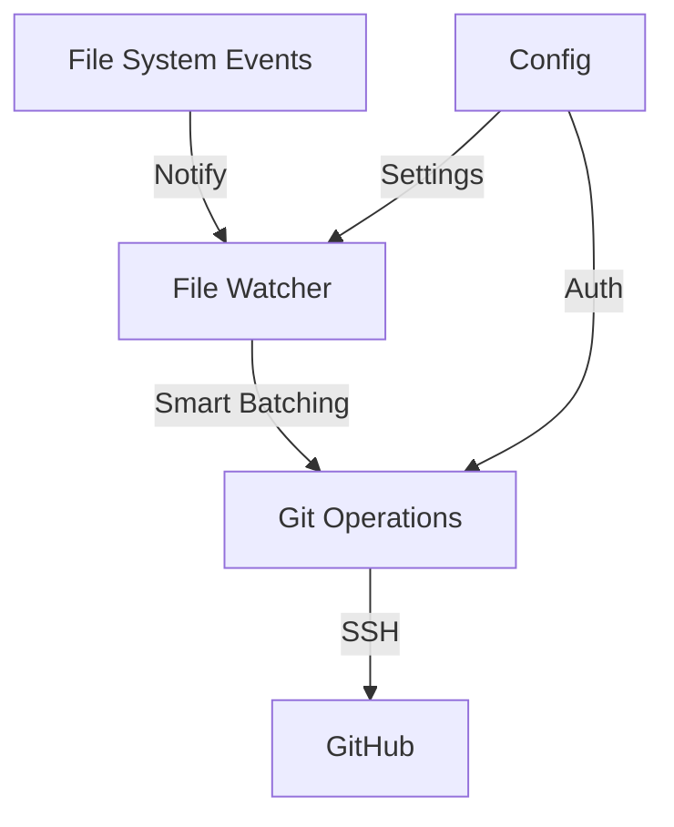

# 🔄 GitHub Sync

<div align="center">


[](https://www.rust-lang.org/)
[](https://github.com)
[](https://opensource.org/licenses/MIT)

*Seamlessly sync your files across devices using Git under the hood* 🚀

</div>

---

## ✨ Features

- 🔐 **Secure**: Uses SSH authentication with GitHub
- 🚀 **Fast**: Written in Rust for maximum performance
- 🤖 **Automated**: Zero Git knowledge required
- 🔄 **Real-time**: Instant sync with smart batching
- 🌐 **Cross-platform**: Works on Linux, macOS, and Windows
- 🎯 **Simple**: Just one command to start syncing

## 🚀 Quick Start

### 1. Installation

```bash
# Install using cargo
cargo install github-sync

# Or build from source
git clone https://github.com/yourusername/github-sync
cd github-sync
cargo install --path .

# Install systemd service (Linux only)
sudo ./install/install.sh
```

### 2. Authentication

```bash
# Set up GitHub authentication
ghs auth <your-github-token>
```

> 🔑 Get your token from [GitHub Settings](https://github.com/settings/tokens/new) with 'repo' scope

### 3. Start Syncing

```bash
# Start syncing a new folder
ghs start -n my-folder

# Your files will be in:
~/.github-sync/my-folder
```

## 🎮 Commands

| Command | Description |
|---------|-------------|
| `ghs auth <token>` | Set up GitHub authentication |
| `ghs start -n <name>` | Create and sync a new folder |
| `ghs stop` | Stop the sync service |
| `ghs status` | Show sync status |
| `ghs config` | Configure sync settings |

## 🏗️ Architecture



### Key Components

- 🔍 **File Watcher**: Monitors file changes with smart batching
- 🔄 **Git Operations**: Handles all Git interactions seamlessly
- 🔐 **Auth Manager**: Secure GitHub token management
- ⚙️ **Config**: User settings and sync preferences

## 🛠️ Technical Details

### Smart Batching

```rust
const BATCH_WINDOW: Duration = Duration::from_secs(2);
const MIN_SYNC_INTERVAL: Duration = Duration::from_secs(5);
```

- Changes are batched for 2 seconds
- Minimum 5-second interval between syncs
- Automatic conflict resolution with backup branches

### File Organization

```
~/.github-sync/           # Main Git Repository
├── project1/              # Your first folder
├── project2/              # Your second folder
└── .git/                 # Single Git repository
```

### System Integration

#### Linux (systemd)
- Runs as a user service with `github-sync@username.service`
- Starts automatically on system boot
- Manages process lifecycle and restarts on failures
- Install: `sudo ./install/install.sh`
- Uninstall: `sudo ./install/uninstall.sh`

#### Windows
- Runs as a Windows Service
- Starts automatically on system boot
- Manages process lifecycle and restarts on failures
- Install: Run `install\windows\install.ps1` as Administrator
- Uninstall: Run `install\windows\uninstall.ps1` as Administrator

## 🤝 Contributing

We love contributions! Please see our [Contributing Guide](CONTRIBUTING.md) for details.

1. Fork the repository
2. Create your feature branch
3. Commit your changes
4. Push to the branch
5. Open a Pull Request

## 📝 License

This project is licensed under the MIT License - see the [LICENSE](LICENSE) file for details.

## 🙏 Acknowledgments

- Built with [Rust](https://www.rust-lang.org/)
- Uses [git2-rs](https://github.com/rust-lang/git2-rs) for Git operations
- File watching powered by [notify](https://github.com/notify-rs/notify)

---

<div align="center">

Made with ❤️ by Omkar Bhor

[⭐ Star on GitHub](https://github.com/yourusername/github-sync) | [🐛 Report Bug](https://github.com/yourusername/github-sync/issues) | [✨ Request Feature](https://github.com/yourusername/github-sync/issues)

</div> 